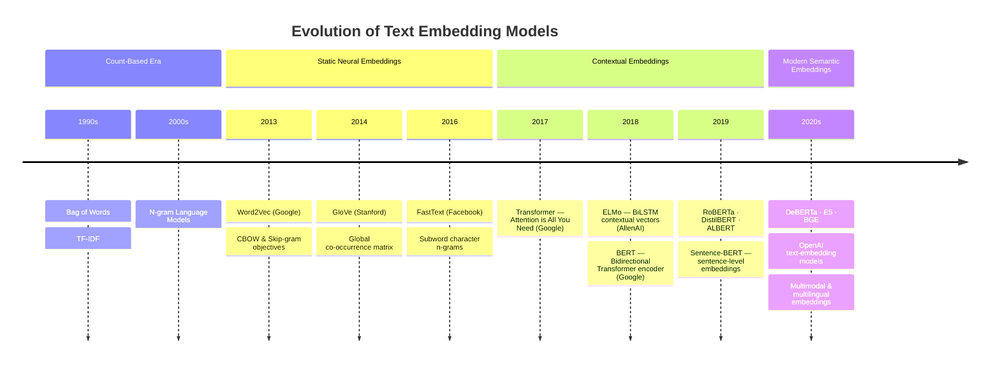

# The Evolution of Text Embedding Models: From N-grams to BERT and Beyond

*ANLP Session 6 — Transformers & Language Models*

---

## Abstract

Text embeddings are numerical representations of language that allow machines to reason about meaning. This paper traces the evolution of embedding models from the earliest count-based approaches through the Word2Vec era and into the Transformer-based models that define modern NLP. We pay particular attention to the conceptual leaps at each stage and the limitations each generation was designed to overcome.

---

## 1. Introduction

At the heart of every NLP system is a representation problem: how do we turn words — symbols in a human writing system — into something a machine can compute with? The answer has changed dramatically over the past three decades.

Early systems treated language as bags of symbols, counting and weighting token frequencies. Neural approaches in the 2010s introduced *dense* representations that captured semantic relationships. The Transformer revolution of the late 2010s added *context-sensitivity*, so that the same word could carry different representations in different sentences. Today, embedding models power search engines, recommendation systems, retrieval-augmented generation (RAG) pipelines, and much more.

Understanding this history is essential for any NLP practitioner. Each generation of models reflects specific assumptions about what language *is*, and those assumptions shape what the models can and cannot do.

---

## Timeline of Key Developments



---

## 2. The Count-Based Era: Bags of Words and N-grams

### 2.1 Bag of Words

The simplest text representation is the **Bag of Words (BoW)** model. A document is represented as a vector where each dimension corresponds to a vocabulary word, and the value is the word's frequency in that document. Word order is discarded entirely — the "bag" metaphor is apt.

BoW vectors are simple to compute but have severe limitations:
- They are extremely high-dimensional and sparse (most entries are zero).
- They have no notion of semantic similarity: "cat" and "feline" are as unrelated as "cat" and "airplane".
- Frequent but uninformative words (the, a, is) dominate the representation.

**TF-IDF** (Term Frequency–Inverse Document Frequency) partially addresses the last problem by downweighting terms that appear in many documents, but the first two problems remain.

### 2.2 N-grams

An **N-gram** is a contiguous sequence of N tokens from a text. Unigrams are single words, bigrams are pairs ("New York"), trigrams are triples ("New York City"). N-gram language models assign probabilities to word sequences using the Markov assumption: the probability of a word depends only on the N−1 words that precede it.

$$P(w_t \mid w_1, \ldots, w_{t-1}) \approx P(w_t \mid w_{t-N+1}, \ldots, w_{t-1})$$

N-grams capture local word order and are useful for tasks like spelling correction, machine translation (historically), and text classification. However, they suffer from the **data sparsity problem**: as N increases, the number of possible sequences grows exponentially, and most are never observed in training data. They also cannot generalise across synonyms.

---

## 3. The Neural Turn: Static Word Embeddings

### 3.1 The Distributional Hypothesis

The shift to neural embeddings was grounded in a linguistic insight known as the **distributional hypothesis**, articulated by linguist John Rupert Firth in 1957:

> *"You shall know a word by the company it keeps."*

Words that appear in similar contexts tend to have similar meanings. Neural embedding models operationalise this idea by training on large text corpora to produce dense, low-dimensional vectors where meaning is encoded in geometry.

### 3.2 Word2Vec (2013)

**Word2Vec**, introduced by Mikolov et al. at Google in 2013, was a watershed moment. It trained a shallow two-layer neural network on a text corpus and used the learned weights as word representations. Two training objectives were proposed:

**Continuous Bag of Words (CBOW):** Given a context window of surrounding words, predict the target word at the centre.

**Skip-gram:** Given a single target word, predict each of the surrounding context words.

> **A note on terminology:** The term *skip-gram* in Word2Vec refers to a *training objective*, not a type of text feature. It is distinct from the *n-gram skip* technique sometimes used in information retrieval. The Word2Vec skip-gram model trains the network to answer: "given this word, what words are likely to appear nearby?"

Word2Vec produced 100–300 dimensional dense vectors with remarkable properties:

- **Semantic clustering**: words with similar meanings cluster together in vector space.
- **Analogical reasoning**: the famous result `king − man + woman ≈ queen` fell out naturally from the geometry.
- **Efficiency**: training was fast enough to run on billion-word corpora.

Word2Vec made it possible for the first time to measure semantic similarity between words numerically, with cosine similarity as the standard metric.

### 3.3 GloVe (2014)

**GloVe** (Global Vectors for Word Representation), from Stanford, took a complementary approach. Rather than local context windows, GloVe built a global word–word co-occurrence matrix from the entire corpus and factorised it. The result was vectors with similar properties to Word2Vec but with better theoretical grounding in corpus-wide statistics.

### 3.4 FastText (2016)

Facebook's **FastText** extended Word2Vec by representing each word not as a single token but as a bag of character **n-grams**. The word "embedding" might be decomposed as `<em`, `emb`, `mbe`, `bed`, `edi`, `din`, `ing`, `ng>`. The word vector is the sum of its character n-gram vectors.

This had two important benefits:
- **Morphological awareness**: related word forms ("run", "running", "runner") share subword components.
- **Out-of-vocabulary handling**: a word never seen in training can still be represented from its character n-grams.

FastText is still widely used for tasks involving morphologically rich languages or specialised vocabularies.

### 3.5 The Core Limitation of Static Embeddings

All of the above models produce **one vector per word**, determined at training time and fixed thereafter. This is a fundamental limitation: natural language is deeply **polysemous**. The word *bank* has entirely different meanings in "river bank" and "bank account", yet Word2Vec assigns it a single vector that is some weighted average across all its uses in the training corpus.

---

## 4. Contextual Embeddings

### 4.1 ELMo (2018)

**ELMo** (Embeddings from Language Models), from Allen Institute for AI, introduced context-sensitivity by using a **bidirectional LSTM** (Long Short-Term Memory) language model. Instead of one fixed vector per word, ELMo computed a representation dynamically based on the full sentence context:

- A forward LSTM read the sentence left to right.
- A backward LSTM read it right to left.
- The two hidden states were concatenated to form a context-aware representation.

For the first time, "bank" in a financial sentence and "bank" in a geographical sentence received genuinely different vectors. ELMo was used as a feature extractor: its representations were computed once and then fed into task-specific models.

---

## 5. The Transformer Era: BERT and Beyond

### 5.1 Attention is All You Need (2017)

Before BERT, the key architectural innovation was the **Transformer** (Vaswani et al., Google, 2017). Transformers replaced recurrence entirely with **self-attention**: a mechanism that allows every token in a sequence to attend to every other token in a single step, regardless of distance. This solved the long-range dependency problem that plagued LSTMs and enabled far more parallelisable training.

### 5.2 BERT (2018)

**BERT** (Bidirectional Encoder Representations from Transformers), introduced by Devlin et al. at Google in 2018, applied the Transformer encoder to language representation at scale. Its key innovations were:

**Masked Language Modelling (MLM):** Randomly mask 15% of input tokens and train the model to predict them. Because the model sees both left and right context simultaneously, it learns genuinely bidirectional representations — unlike GPT, which was trained left-to-right only.

**Next Sentence Prediction (NSP):** Given two sentences A and B, predict whether B actually follows A in the original text. This encouraged the model to learn sentence-level semantic relationships.

BERT was **pre-trained** on BooksCorpus and English Wikipedia (3.3 billion words) and could then be **fine-tuned** on downstream tasks with minimal task-specific architecture. It set new state-of-the-art results on eleven NLP benchmarks upon release.

| Property | Word2Vec | ELMo | BERT |
|---|---|---|---|
| Architecture | Shallow NN | Bidirectional LSTM | Transformer Encoder |
| Representation | Static | Contextual | Contextual |
| Directionality | N/A | Bidirectional (sequential) | Fully bidirectional (parallel) |
| Polysemy handling | No | Yes | Yes |
| Fine-tunable | No | Limited | Yes |
| Scale of pre-training | ~1B tokens | ~1B tokens | ~3.3B tokens |

### 5.3 The BERT Family

BERT sparked a wave of derivatives:

- **RoBERTa** (Facebook, 2019): BERT retrained longer, on more data, without NSP. Showed that much of BERT's gains came simply from scale.
- **DistilBERT** (HuggingFace, 2019): a distilled, 40% smaller version retaining 97% of performance.
- **ALBERT** (Google, 2019): parameter-efficient BERT variant with factorised embeddings and cross-layer parameter sharing.
- **DeBERTa** (Microsoft, 2020): added disentangled attention over content and position separately.

### 5.4 Sentence and Semantic Embeddings

BERT solved context-sensitivity at the token level, but many real-world tasks operate at the sentence or document level. Consider semantic search: given a query, you want to retrieve the most relevant document from a large corpus. Comparing token-by-token is computationally intractable at scale — you need a single fixed-size vector per sentence so that similarity can be measured with a fast operation like cosine distance. The same need arises in RAG pipelines, duplicate detection, clustering, and recommendation systems.

The naive approach — taking the mean or `[CLS]` token embedding from a pre-trained BERT model — performed surprisingly poorly on these tasks. BERT was trained to understand language, not to produce geometrically meaningful sentence-level representations. Two semantically identical sentences could end up far apart in the embedding space.

BERT's token-level representations therefore needed a dedicated fine-tuning step to produce sentence-level embeddings, and naive pooling performed poorly on semantic similarity tasks. **Sentence-BERT (SBERT)** (Reimers & Gurevych, 2019) addressed this by fine-tuning BERT with a **siamese network** architecture on natural language inference data. Two sentences were encoded in parallel and trained so that semantically similar sentences had similar pooled representations.

SBERT-style models are the backbone of modern semantic search and RAG retrieval components.

---

## 6. Summary: The Conceptual Arc

The evolution of embedding models can be understood as a sequence of solutions to progressively refined problem statements:

```
Problem                          Solution
─────────────────────────────────────────────────────────────────────────
"Words need numeric form"    →   Bag of Words, TF-IDF, N-grams
"Meaning should be similar   →   Word2Vec, GloVe, FastText
 for similar words"
"The same word means         →   ELMo (BiLSTM)
 different things in context"
"Context needs to be fully   →   BERT (Transformer)
 bidirectional and deep"
"Sentences need embeddings   →   SBERT, E5, BGE, OpenAI embeddings
 not just tokens"
```

Each generation retained the best ideas of the previous one while eliminating its central weakness. N-grams provided local structure; neural models added semantic geometry; contextual models added polysemy resolution; Transformers scaled context modelling to full sequences; sentence models made embeddings usable for retrieval and similarity at the document level.

---

## 7. Looking Ahead: Connections to Upcoming Sessions

The concepts introduced in this paper are not self-contained — they form the foundation for several topics covered later in the course.

### Session 7 — LLM Deep Dive (30 Mar)

BERT is an *encoder-only* Transformer. Large Language Models (LLMs) such as GPT, Claude, and Llama are *decoder-only* Transformers, trained at orders-of-magnitude greater scale on far larger corpora. They inherit everything discussed in this paper — the Transformer architecture, contextual representations, bidirectional attention in their internal layers — but are trained with a *next-token prediction* objective rather than masked language modelling. Session 7 examines these models in depth, including how prompting techniques interact with the representations learned during pre-training, and how we evaluate and reason about the risks of models at this scale.

### Session 8 — Building LLM Apps & RAG (13 Apr)

Section 5.4 of this paper mentioned RAG (Retrieval-Augmented Generation) pipelines as one of the primary use cases for sentence embeddings. Session 8 makes this concrete: you will build a working RAG pipeline using semantic embedding models, vector stores (FAISS and OpenAI Vector Store), and an LLM generator. The retrieval step in that pipeline depends entirely on the sentence-level embeddings described in this paper — the query and each document chunk are embedded independently and compared by cosine similarity to find the most relevant context to pass to the LLM.

### Session 10 — Ethics in NLP (4 May)

Embedding models do not learn language in a vacuum — they learn from human-generated text, and human text encodes social biases. Word2Vec became a landmark case study in this problem: its training corpus caused it to associate "doctor" with male pronouns and "nurse" with female pronouns, reflecting historical patterns in text rather than any ground truth. BERT and its descendants inherit similar biases at greater depth and subtlety. Session 10 addresses the ethical dimensions of NLP systems, including how biases enter models through training data, how they propagate into downstream applications, and what mitigation strategies exist.

---

## 8. Conclusion

Text embeddings are not a solved problem — research continues into multimodal, multilingual, and task-specialised embeddings — but the trajectory from sparse count vectors to deep contextual Transformer representations represents one of the clearest and most impactful progressions in the history of machine learning. Understanding where each model sits in this history, and why it was designed the way it was, is essential groundwork for working with modern NLP systems.

---

## 9. References

- Harris, Z. S. (1954). Distributional structure. *Word, 10*(2–3), 146–162.
- Firth, J. R. (1957). A synopsis of linguistic theory 1930–1955. *Studies in Linguistic Analysis.*
- Mikolov, T., et al. (2013). Efficient estimation of word representations in vector space. *arXiv:1301.3781.*
- Pennington, J., Socher, R., & Manning, C. D. (2014). GloVe: Global vectors for word representation. *EMNLP 2014.*
- Bojanowski, P., et al. (2017). Enriching word vectors with subword information (FastText). *TACL, 5*, 135–146.
- Peters, M. E., et al. (2018). Deep contextualized word representations (ELMo). *NAACL 2018.*
- Vaswani, A., et al. (2017). Attention is all you need. *NeurIPS 2017.*
- Devlin, J., et al. (2019). BERT: Pre-training of deep bidirectional transformers for language understanding. *NAACL 2019.*
- Reimers, N., & Gurevych, I. (2019). Sentence-BERT: Sentence embeddings using Siamese BERT-networks. *EMNLP 2019.*
