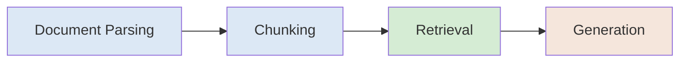
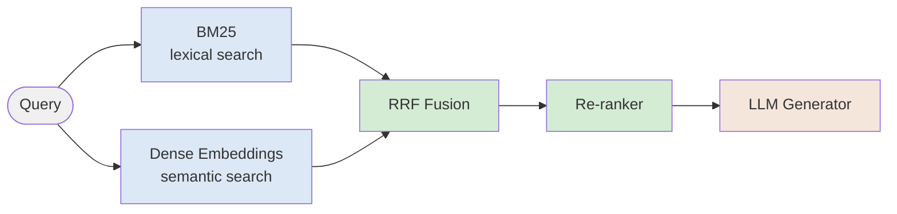
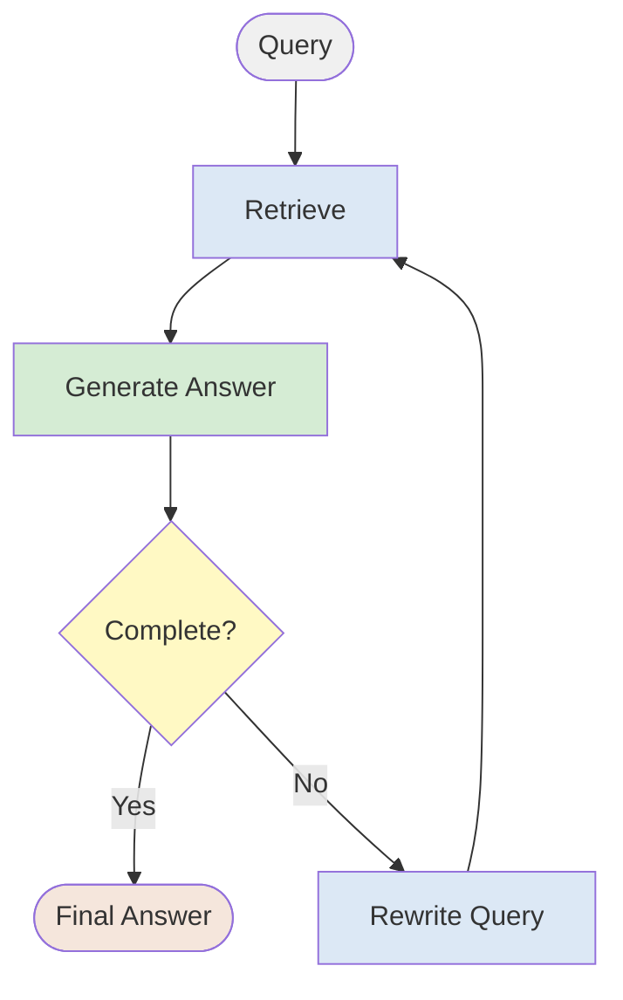
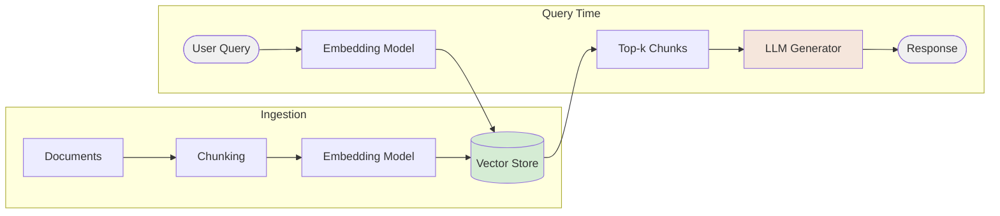

Week 9
13 April 2026
Session 8

topics:
- LLM API Access (OpenAI Chat Completions + Responses API, Claude, Ollama)
- RAG (Retrieval-Augmented Generation)
- Vector Stores: FAISS and OpenAI Vector Store
- Hands-on: Build a minimal RAG app

## Notes

- Session 8 is where students formally learn LLM API access — builds on the light GitHub Models preview from Session 7
- Provider swap pattern: show how changing `base_url` + `model` switches between OpenAI, Claude, and Ollama
- RAG hands-on scoped to one outcome: a working pipeline over a small document set (chunk → embed → FAISS → retrieve → generate)
- Hybrid search (BM25 + semantic + RRF) and Agentic RAG covered conceptually as production best practice / Session 9 preview
- `responses api and vector store.md` (in Session 9 folder) contains reference code for the Responses API and vector stores — §1–3 and §5–8 belong to Session 8; §4 (Agents SDK) belongs to Session 9

## Planned Notebooks

- `notebooks/01_llm_api_access.ipynb` — OpenAI Chat Completions, Responses API, Claude API, Ollama; provider swap pattern
- `notebooks/02_rag_with_faiss.ipynb` — chunking, sentence-transformers embeddings, FAISS index, RAG query pipeline, RAG vs. no-RAG comparison

## References

- `vector_similarity.md` — cosine similarity, dot product, unit normalisation explainer
- Lewis et al. (2020) — RAG paper, NeurIPS
- Reimers & Gurevych (2019) — Sentence-BERT, EMNLP
- Johnson et al. (2019) — FAISS paper
- Robertson et al. (1994) — BM25 (Okapi at TREC-3)
- RAG Deep Dive video: https://www.youtube.com/watch?v=AS_HlJbJjH8
- https://isragdeadyet.com

# Video reference notes (RAG Deep Dive: Retrieval Approaches, Agentic Search & Production Trade-offs)

## RAG as a system
- RAG is not just one model — it is a pipeline: document parsing → chunking → retrieval → generation. Each stage needs to be designed and evaluated independently.



- Moving from demo to production commonly breaks on four issues: accuracy drops on complex queries, latency, scaling to large document sets, and cost per query.
- Compliance and entitlements (who can see which documents) is a critical production concern that is easy to miss in early prototypes.
- **Foundational paper:** Lewis et al. (2020) "Retrieval-Augmented Generation for Knowledge-Intensive NLP Tasks" — introduced the RAG framework combining a dense retriever (DPR) with a seq2seq generator (BART), showing that grounding generation in retrieved documents significantly reduces hallucination on open-domain QA tasks. _NeurIPS 2020._

## Scoping a RAG use case
- Before designing the system, map out the expected query types: simple keyword lookups, semantic variations, multi-hop questions, answers spanning multiple documents, or open-ended agentic queries.
- Consider the cost of a mistake — the higher the stakes, the more accuracy investment is justified (e.g., medical vs. code assistant).
- Define trade-offs upfront: speed vs. accuracy vs. cost. These govern every architectural decision.

## Retrieval approaches

### BM25 (lexical search)
- BM25 builds an inverted index over all words in the corpus and scores documents based on term frequency and rarity (TF-IDF style).
- Very fast — orders of magnitude faster than linear (Ctrl+F style) search. A strong and underrated baseline.
- Limitation: fails on semantic variation — searching "physician" will not match documents containing "doctor".
- Best fit when users already know the domain keywords, or when used inside an agentic loop (see below).

**Scoring formula:**

$$\text{Score}(D, Q) = \sum_{i} \text{IDF}(q_i) \cdot \frac{f(q_i, D) \cdot (k_1 + 1)}{f(q_i, D) + k_1 \cdot \left(1 - b + b \cdot \frac{|D|}{\text{avgdl}}\right)}$$

$$\text{IDF}(q_i) = \log\left(\frac{N - n(q_i) + 0.5}{n(q_i) + 0.5} + 1\right)$$

Where:
- $f(q_i, D)$ = term frequency of query term $q_i$ in document $D$
- $|D|$ = length of document $D$ (word count); $\text{avgdl}$ = average document length in corpus
- $N$ = total documents; $n(q_i)$ = number of documents containing $q_i$
- Rare terms get higher IDF weight; near-universal terms approach zero
- $k_1 \in [1.2, 2.0]$ — controls term frequency saturation (diminishing returns for repeated terms)
- $b = 0.75$ — controls length normalisation (penalises retrieval from unusually long documents)

**Academic references:**
- Robertson, S. & Spärck Jones, K. (1976). "Relevance weighting of search terms." — foundational probabilistic retrieval model that BM25 builds on.
- Robertson, S. et al. (1994). "Okapi at TREC-3." — introduced the BM25 scoring function.
- Robertson, S. & Zaragoza, H. (2009). "The Probabilistic Relevance Framework: BM25 and Beyond." _Foundations and Trends in Information Retrieval._

### Static embeddings
- Each word gets a fixed numerical vector regardless of context (similar to Word2Vec).
- Rooted in the **distributional hypothesis**: words that appear in similar contexts have similar meanings (Harris, 1954).
- Extremely fast, runs on CPU, but loses meaning for polysemous words (e.g. "model" in AI vs. fashion) because the same word always maps to the same vector regardless of surrounding context.

**Academic references:**
- Mikolov, T. et al. (2013). "Distributed Representations of Words and Phrases and their Compositionality." _NeurIPS._ — introduced Word2Vec (Skip-gram and CBOW).
- Pennington, J. et al. (2014). "GloVe: Global Vectors for Word Representation." _EMNLP._ — matrix factorisation approach to static embeddings.

### Semantic embedding models (sentence transformers)
- Encode full sentences/chunks into dense vectors that capture meaning, not just keywords, using a **dual encoder** (bi-encoder) architecture: query and document are each encoded independently, then compared.
- Enable semantic search: "physician" and "doctor" map to nearby vectors, so they match correctly.
- Trade-off: slower and more compute-intensive than BM25 or static embeddings.
- Evaluate models using leaderboards (e.g. MTEB on Hugging Face) — consider accuracy, speed, embedding dimension, and domain fit.
- Matryoshka embedding models allow flexible embedding sizes (e.g. 64 vs. 768 dimensions) without sacrificing much quality.

**Similarity metric:**

$$\text{cosine\_similarity}(q, d) = \frac{q \cdot d}{\|q\| \cdot \|d\|} \in [-1, 1]$$

```python
similarity = np.dot(q, d) / (np.linalg.norm(q) * np.linalg.norm(d))
```

- Inner product of L2-normalised vectors; $1$ = identical direction, $0$ = orthogonal, $-1$ = opposite.
- Dot product search (without normalisation) is used when magnitude carries signal (e.g. in matryoshka models).

**Relationship between cosine similarity and dot product:** cosine similarity is the normalised, scale-invariant version of the dot product — it removes the effect of vector magnitude and measures only the angle between vectors. The dot product is unbounded and sensitive to magnitude; cosine similarity is bounded to $[-1, 1]$.

$$\text{dot product}(q, d) = q \cdot d \qquad \text{cosine similarity}(q, d) = \frac{q \cdot d}{\|q\| \cdot \|d\|}$$

> 📄 See [vector_similarity.md](vector_similarity.md) §1 (Cosine Similarity) and §2 (Dot Product Similarity) for a full breakdown with worked examples and comparison table.


**Practical note:** Most modern embedding models (OpenAI, Cohere, etc.) output unit-normalised vectors where $\|q\| = \|d\| = 1$. When vectors are unit-normalised, the denominator equals 1 and dot product $\equiv$ cosine similarity — making dot product the faster choice (one less computation). This is why vector databases like Pinecone default to dot product. Always check your embedding model's documentation to confirm whether it normalises outputs before choosing a similarity metric.

> 📄 See [vector_similarity.md](vector_similarity.md) §3 (Vector Notation), §4 (Unit Normalisation / L2 Normalisation), and §5 (OpenAI Embeddings) for detailed explanation, the normalisation formula, Python code, and a note on the dimension truncation gotcha.

**Architecture note:** Sentence transformers use a BERT-style transformer encoder with mean pooling over the final token hidden states to produce a fixed-length sentence embedding. The model is fine-tuned using contrastive loss (e.g. Multiple Negatives Ranking Loss) on (query, positive passage, negative passage) triplets.

**Academic references:**
- Devlin, J. et al. (2019). "BERT: Pre-training of Deep Bidirectional Transformers for Language Understanding." _NAACL._ — the backbone architecture for most modern embedding models.
- Reimers, N. & Gurevych, I. (2019). "Sentence-BERT: Sentence Embeddings using Siamese BERT-Networks." _EMNLP._ — introduced the bi-encoder architecture for efficient semantic similarity.
- Muennighoff, N. et al. (2023). "MTEB: Massive Text Embedding Benchmark." _EACL._ — the standard benchmark for evaluating and comparing embedding models.

### Re-rankers (cross-encoders)
- A re-ranker takes a (query, chunk) pair and scores how relevant the chunk is to the query.
- Used as a second pass after initial retrieval: retrieve a larger set (e.g. top-100), then re-rank to find the best few (e.g. top-5) to pass to the LLM.
- Improves accuracy but adds latency — choose re-ranker size based on latency budget.
- Instruction-following re-rankers (e.g. from Contextual AI) allow custom ranking priorities via a prompt.

**Architecture note:** Unlike bi-encoders (which embed query and document separately), a cross-encoder concatenates the query and document as a single input `[CLS] query [SEP] document [SEP]`, passes it through a transformer, and uses the `[CLS]` token representation to predict a relevance score directly. This joint attention over both texts makes cross-encoders more accurate but much slower — they cannot pre-compute document embeddings offline.

```
input:  [CLS] query [SEP] chunk [SEP]
output: scalar relevance score ∈ ℝ
```

**Academic references:**
- Nogueira, R. & Cho, K. (2019). "Passage Re-ranking with BERT." _arXiv._ — demonstrated that BERT as a cross-encoder significantly outperforms BM25 re-ranking on MS MARCO.
- Nogueira, R. et al. (2020). "Document Ranking with a Pretrained Sequence-to-Sequence Model." _EMNLP Findings._ — extended re-ranking with generative models (MonoT5).

### Hybrid search (recommended baseline)
- Combine BM25 (lexical) + semantic embeddings, fuse results using Reciprocal Rank Fusion (RRF), then pass through a re-ranker.
- This is the recommended production baseline before experimenting with more complex approaches.
- Do not jump to advanced methods (GraphRAG, ColBERT, SPLADE) before validating that this baseline is insufficient.




**Reciprocal Rank Fusion (RRF) formula:**

$$\text{RRF\_score}(d) = \sum_{s} \frac{1}{k + \text{rank}_s(d)}$$

Where:
- $\text{rank}_s(d)$ = rank position of document $d$ in result list from system $s$ (BM25, dense, etc.)
- $k = 60$ (standard constant — dampens the impact of very high-rank documents)
- Sum is over all retrieval systems being fused
- Documents ranked highly by multiple systems accumulate higher RRF scores

**Why RRF works:** it is robust to score scale differences between systems (BM25 scores and cosine similarities are not directly comparable), and privileges documents that consistently rank well across multiple retrievers rather than those that score extremely high in just one.

**Academic references:**
- Cormack, G.V. et al. (2009). "Reciprocal Rank Fusion Outperforms Condorcet and Individual Rank Learning Methods." _SIGIR._ — original RRF paper; showed that simple rank fusion outperforms more complex ensemble methods.
- Karpukhin, V. et al. (2020). "Dense Passage Retrieval for Open-Domain Question Answering." _EMNLP._ — introduced DPR, the dense retriever most commonly paired with BM25 in hybrid setups.

## Agentic RAG
- Instead of a single retrieval call, an LLM reasoning model iteratively rewrites the query, retrieves, checks whether the answer is complete, and retrieves again if needed.
- Significantly improves accuracy on complex, multi-hop questions — at the cost of higher latency.
- Key finding: BM25 inside an agentic loop can outperform semantic embeddings in single-shot RAG, because the LLM handles semantic variation by rewriting the query itself.
- Use agentic RAG when accuracy is critical and users can tolerate longer response times. Use single-shot RAG when low latency is required.
- Agentic RAG also sets a useful upper-bound benchmark — any gap between single-shot and agentic accuracy shows where chunking or retrieval can be improved.
- **Preview of Session 9:** Agentic RAG is the simplest example of an LLM agent — an LLM using a tool (retrieval) in a loop with self-directed control flow.

**Control loop:**




**Academic references:**
- Asai, A. et al. (2023). "Self-RAG: Learning to Retrieve, Generate, and Critique through Self-Reflection." _ICLR 2024._ — introduced a model that dynamically decides when to retrieve and evaluates its own output using reflection tokens.
- Trivedi, H. et al. (2023). "Interleaving Retrieval with Chain-of-Thought Reasoning for Knowledge-Intensive Multi-Step Questions." _ACL._ — (IRCoT) demonstrated that interleaving retrieval steps with reasoning chains significantly improves multi-hop QA.
- Su, H. et al. (2024). "BRIGHT: A Realistic and Challenging Benchmark for Reasoning-Intensive Retrieval." — the benchmark used in the video to evaluate agentic retrieval approaches.

## Operational considerations
- Use FAISS or similar libraries for efficient vector computation.
- For small corpora, in-memory storage is sufficient. For large corpora, use a vector database (choose based on latency requirements).
- Add metadata to chunks (e.g. document type, date, author) to filter before retrieval — essential for maintaining accuracy at scale.
- Retrieval quality degrades as document volume grows; metadata filtering is the primary mitigation strategy.

# Vector store reference notes

## What is a vector store?
- A vector store is a database that stores embedding vectors and supports efficient similarity search (finding the most relevant chunks for a given query).
- It sits between the embedding model and the LLM generator in a RAG pipeline: embed the query → search the vector store → retrieve top-k chunks → pass to LLM.
- Two key operations: **indexing** (store document chunk embeddings at ingestion time) and **querying** (find nearest vectors to a query embedding at runtime).




## FAISS (Facebook AI Similarity Search)
- An open-source library from Meta for fast similarity search over dense vectors, designed to run locally.
- Supports multiple index types — flat (exact, brute-force), IVF (approximate, partitioned), HNSW (graph-based approximate) — each with different speed/accuracy trade-offs.
- Flat index: exact search, most accurate, but slow at scale. Use for small corpora or as a benchmark.
- IVF (Inverted File Index): partitions the vector space into Voronoi cells using k-means clustering; at query time only the nearest cells are searched — reduces compute at the cost of recall.
- HNSW (Hierarchical Navigable Small World): graph-based ANN; builds a multi-layer proximity graph where higher layers enable long-range jumps and lower layers refine locally — excellent speed/recall trade-off.
- Runs in-memory — embeddings are loaded into RAM for fast access. No server required.
- Does not handle embedding generation — you bring your own embedding model (e.g. sentence transformers, OpenAI embeddings).
- **Does not support BM25 or hybrid search natively.** To do hybrid search with FAISS, you run BM25 separately (e.g. using `rank_bm25`) and fuse the results yourself using RRF — FAISS only handles the dense vector side.
- Best for: local development, prototyping, and learning what is happening under the hood in a RAG pipeline.

**Academic references:**
- Johnson, J. et al. (2019). "Billion-scale similarity search with GPUs." _IEEE Transactions on Big Data._ — the original FAISS paper.
- Malkov, Y. & Yashunin, D. (2020). "Efficient and robust approximate nearest neighbor search using Hierarchical Navigable Small World graphs." _IEEE TPAMI._ — the HNSW algorithm used by FAISS's most popular index type.

## OpenAI Vector Store (Responses API)
- A managed vector store provided by OpenAI, designed to work natively with OpenAI embeddings and the Responses API.
- Handles embedding generation, storage, and retrieval as a single managed service — no need to run your own index.
- Supports file uploads directly; OpenAI chunks, embeds, and indexes documents automatically.
- Retrieval is triggered via the `file_search` tool in the Responses API — the LLM calls it as needed during a conversation.
- At ingestion, uploaded files are automatically chunked and embedded using OpenAI's embedding model. At query time, your query is embedded using the same model and a similarity search is run — you never call an embedding model explicitly; it is all abstracted inside `file_search`.
- **Semantic search only — does not support BM25 or hybrid search.** There is no built-in keyword search layer.
- Limitation: tightly coupled to OpenAI's embedding models and API — less control over chunking strategy, index type, and retrieval parameters compared to FAISS.
- Best for: rapid prototyping and production apps built on top of the OpenAI ecosystem, where simplicity and managed infrastructure matter more than retrieval flexibility.

## Azure AI Search
- A fully managed enterprise search service from Microsoft that natively supports hybrid search out of the box.
- Combines BM25 (keyword) and dense vector search in a single query, with built-in Reciprocal Rank Fusion (RRF) to merge results — no manual orchestration required.
- Optional semantic re-ranking layer (powered by Microsoft's language models) further improves result quality as a second pass.
- Supports filtering, faceting, and access control — well suited for enterprise RAG with large, multi-tenant document sets.
- Bring your own embedding model or use Azure OpenAI embeddings for the vector component.
- Best for: production RAG systems that need the full hybrid search baseline (BM25 + semantic + re-ranking) without building and maintaining it yourself.

## Hybrid search support comparison

| | FAISS | OpenAI Vector Store | Azure AI Search |
|---|---|---|---|
| Dense (semantic) search | Yes | Yes | Yes |
| BM25 (keyword) search | No | No | Yes (built-in) |
| Hybrid search | Manual (you build it) | No | Yes (built-in, native) |
| RRF fusion | Manual | No | Built-in |
| Semantic re-ranking | Manual | No | Yes (add-on) |
| Managed service | No | Yes | Yes |
| Embedding model choice | Any | OpenAI only | Any (incl. Azure OpenAI) |

- Use **OpenAI Vector Store** to get a working RAG prototype quickly — accept that retrieval is semantic-only.
- Use **FAISS** to learn the internals and build a custom pipeline; add BM25 and RRF manually if you need hybrid.
- Use **Azure AI Search** when you need production-grade hybrid search (the recommended baseline from the RAG video) without assembling the components yourself.
